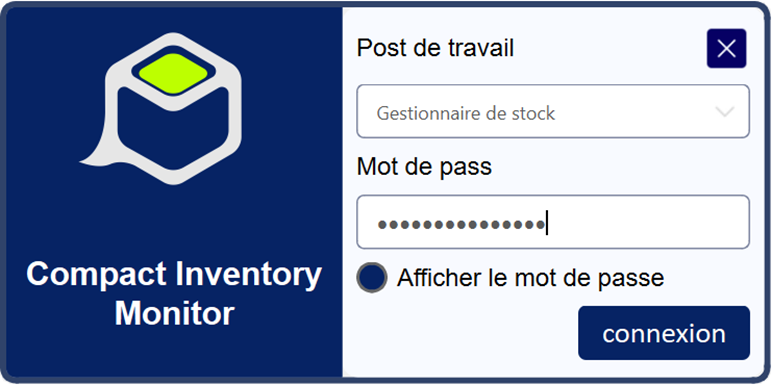
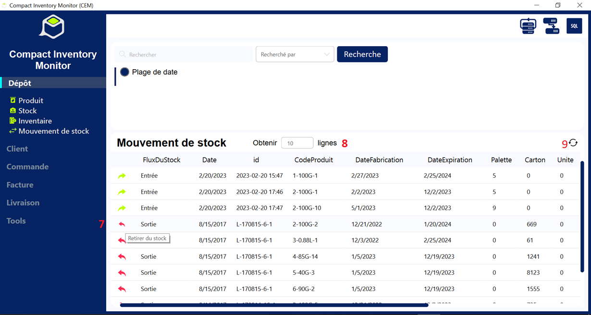
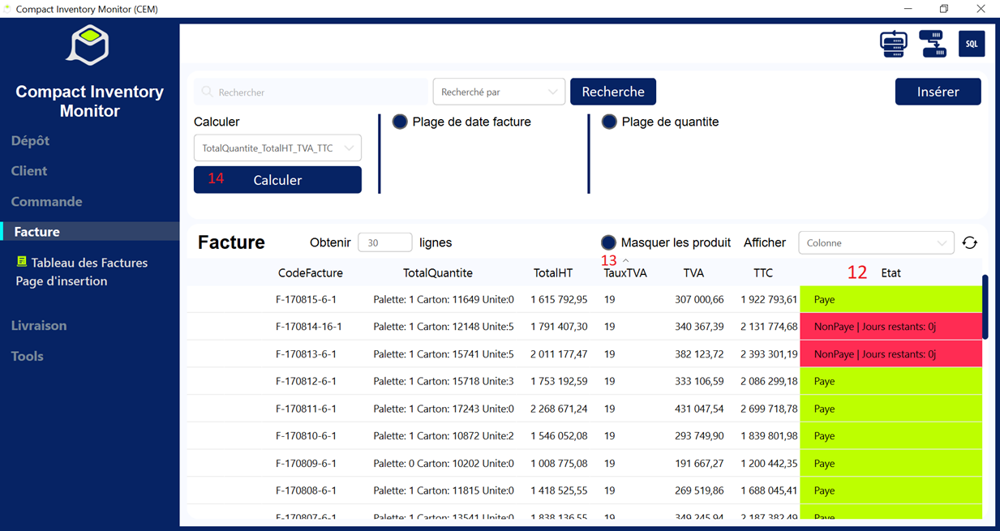
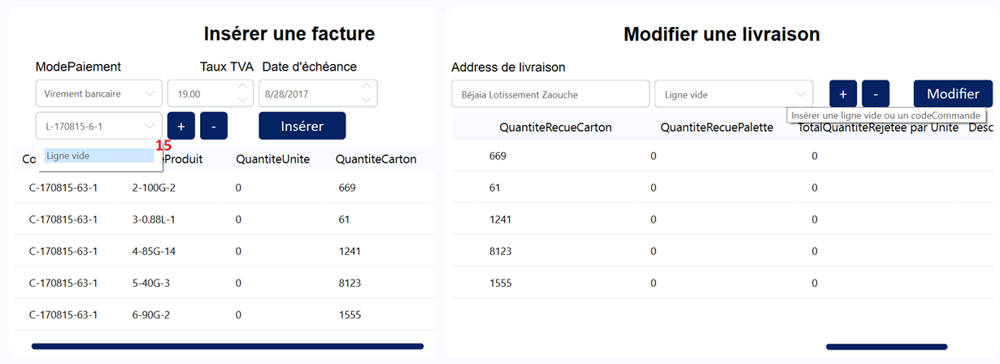
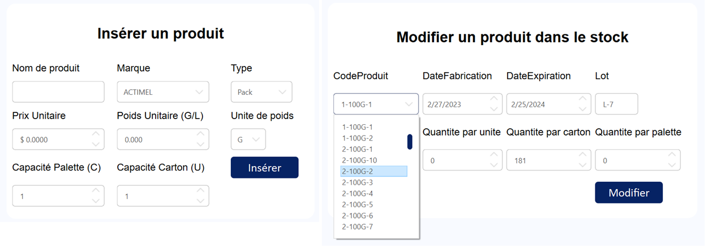
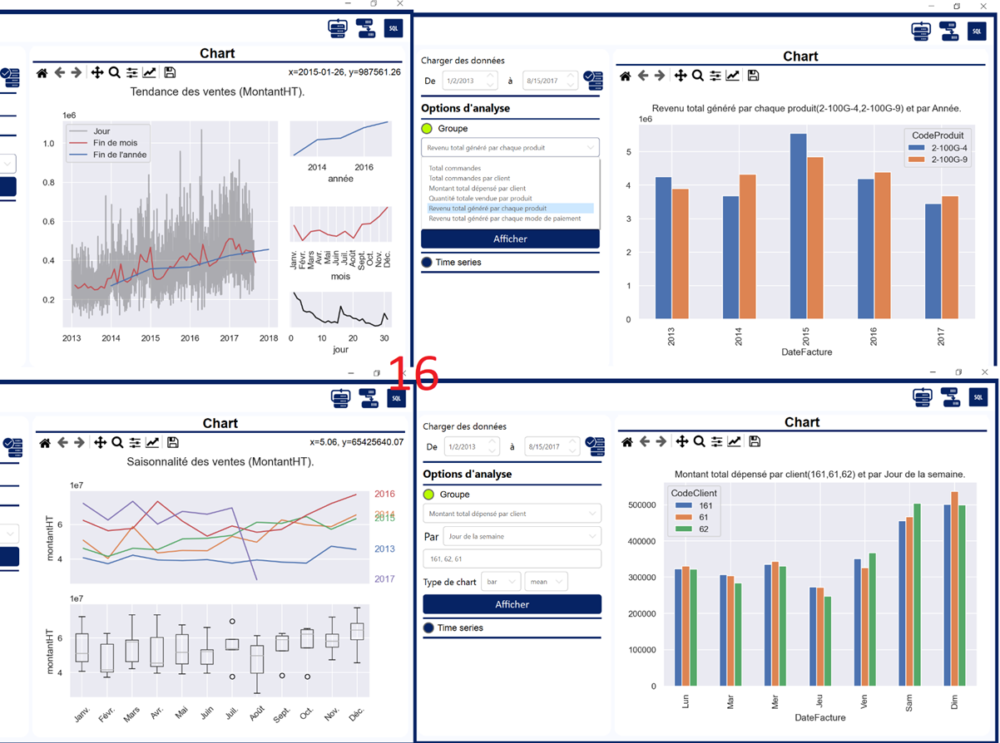
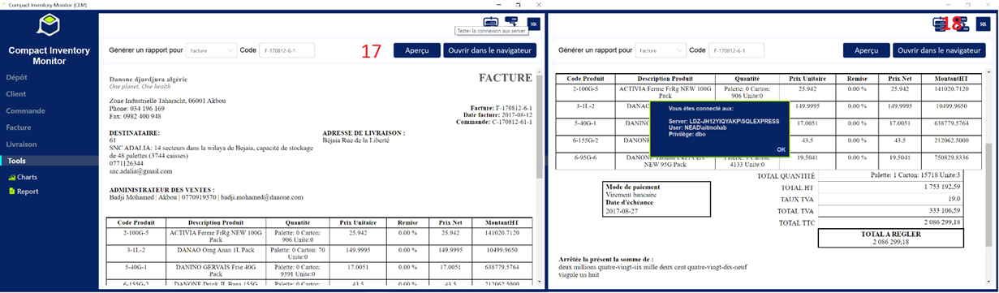

# Description
This is a sales and inventory management desktop application built with Python and PyQt5. It is designed to help businesses manage their inventory, sales, and payments efficiently.

## CIM images

<table><thead><tr><th>N°</th><th>Description</th></tr></thead><tbody><tr><td>1</td><td>Buttons to access pages</td></tr><tr><td>2</td><td>Search in the table with different filters</td></tr><tr><td>3</td><td>Access to the insertion page</td></tr><tr><td>4</td><td>Select the record to access the editing page or delete the selected record</td></tr><tr><td>5</td><td>Stock quantities colored for easy visualization</td></tr><tr><td>6</td><td>Last inventory check and quantity match</td></tr><tr><td>7</td><td>Click on the side buttons to remove or add stock quantity of the selected product</td></tr><tr><td>8</td><td>Limit extracted rows from the database to avoid server pressure</td></tr><tr><td>9</td><td>Refresh the table</td></tr><tr><td>10</td><td>The order status is calculated 50% for completed deliveries and 50% for paid invoices</td></tr><tr><td>11</td><td>An order can have multiple products. Click checkbox to hide products</td></tr><tr><td>12</td><td>Invoice status and remaining days</td></tr><tr><td>13</td><td>Click on the column header to sort the table</td></tr><tr><td>14</td><td>Select what you want to calculate, then click "Calculate" to perform the calculation</td></tr><tr><td>15</td><td>You can type in a delivery code or an order code and then click "+" to display related records, which will minimize insertion errors</td></tr><tr><td>16</td><td>Sales visualization and analysis simplified in one click</td></tr><tr><td>17</td><td>Generate an invoice or a delivery note in one click</td></tr><tr><td>18</td><td>Click on the sql button to check if you are connected to the database</td></tr></tbody></table>

## License
This project is licensed under the MIT License. See the LICENSE file for details.
